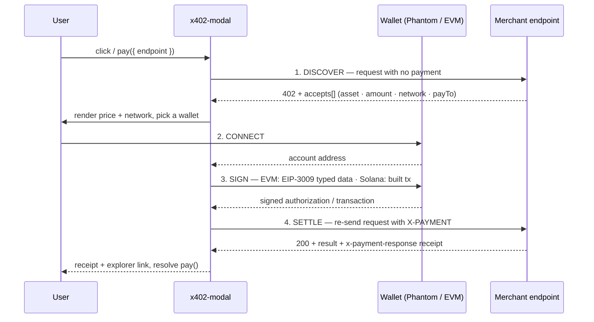

<div align="center">

# @three-ws/x402-modal

**A drop-in payment modal for any [x402](https://x402.org) paid endpoint.**

One `<script>` tag turns an HTTP `402 Payment Required` into a polished checkout:
discover the challenge, connect a wallet (Phantom on Solana, MetaMask / any EVM
wallet via EIP-3009), sign, settle, and show a receipt — in **vanilla JS, with no
bundler and no framework**.

[](https://www.npmjs.com/package/@three-ws/x402-modal)
[](https://www.jsdelivr.com/package/npm/@three-ws/x402-modal)


[Install](#install) · [Quickstart](#quickstart) · [How it works](#how-it-works) · [API](#api-reference) · [Configuration](#configuration-reference) · [Frameworks](#framework-guides) · [Wallets](#wallets--assets) · [FAQ](#faq--troubleshooting)

</div>

---

## What & why

[x402](https://x402.org) revives HTTP `402 Payment Required` as a real payment
rail: a server answers a request with a `402` whose body lists what it
`accepts` (asset · amount · network · pay-to), the client pays, and re-sends the
request with an `X-PAYMENT` header. It is built for pay-per-call APIs, agent
economies, and content paywalls — but every merchant ends up rebuilding the same
fiddly client: parse the challenge, connect a wallet, sign the right thing for
the right chain, retry, settle, and show a receipt.

**This package is that client, done once and done well.** Point it at a `402`
endpoint and it renders the entire flow.

### Features

- **Zero-config drop-in** — one `<script>` tag binds every `data-x402-endpoint`
  element on the page. No build step, no framework, no wallet adapter.
- **Works against any origin** — the `402 → sign → settle` flow is
  merchant-agnostic. Point it at your endpoint or someone else's.
- **Solana + EVM** — Phantom on Solana, MetaMask / any injected `window.ethereum`
  on Base and other EVM chains. USDC by default; arbitrary SPL tokens supported.
- **No bundler required** — ships a single self-contained IIFE for `<script>`
  use, plus a side-effect-free ESM build for bundlers.
- **Gasless for the payer** — EVM uses EIP-3009 signed authorizations; Solana
  uses a facilitator fee-payer. The buyer never needs native gas.
- **Spending caps** — per-wallet `localStorage` caps by call / hour / day, so an
  autonomous agent can't overspend.
- **Zero runtime dependencies** — the two optional wallet libraries are loaded
  on demand from a CDN, only when that wallet path actually runs.
- **Every state designed** — discover, connect, sign, settle, retry, error, and
  receipt all render as live rows with light/dark theming.

The EVM/Base path is **100% client-side**. The Solana path needs one small
backend helper (see [The backend](#the-solana-backend)).

---

## Install

### npm (bundlers / frameworks)

```sh
npm i @three-ws/x402-modal
```

```js
import { pay, configure } from '@three-ws/x402-modal'; // ESM, no side effects
```

### CDN `<script>` (no install, no bundler)

The `/global` build auto-binds `[data-x402-endpoint]` elements and exposes
`window.X402`. Pick a CDN:

```html
<!-- unpkg -->
<script type="module" src="https://unpkg.com/@three-ws/x402-modal/global"></script>

<!-- jsDelivr -->
<script type="module" src="https://cdn.jsdelivr.net/npm/@three-ws/x402-modal/global"></script>
```

> Pin a version for production, e.g.
> `https://unpkg.com/@three-ws/x402-modal@0.2.0/global`.

The CDN bundle is a single self-contained file (~12 kB gzipped). No `npm`, no
build step.

---

## Quickstart

The smallest possible page that pops the modal and settles a `402`. Save it as
`index.html`, replace the endpoint with your own x402 route, and open it:

```html
<!doctype html>
<html lang="en">
  <head><meta charset="utf-8" /><title>x402 checkout</title></head>
  <body>
    <button
      data-x402-endpoint="https://api.example.com/paid/summarize"
      data-x402-method="POST"
      data-x402-body='{"text":"hello world"}'
      data-x402-merchant="Acme"
      data-x402-action="Summarize">
      Pay &amp; summarize
    </button>

    <pre id="out"></pre>

    <script type="module" src="https://unpkg.com/@three-ws/x402-modal/global"></script>
    <script type="module">
      const btn = document.querySelector('button');
      btn.addEventListener('x402:result', (e) => {
        document.getElementById('out').textContent =
          JSON.stringify(e.detail.result, null, 2);
      });
      btn.addEventListener('x402:error', (e) => {
        document.getElementById('out').textContent = 'Error: ' + e.detail.error;
      });
    </script>
  </body>
</html>
```

Clicking the button opens the modal, runs the payment, calls the endpoint, and
fires `x402:result` on the button with the full
`{ ok, result, payment, response }` payload.

Prefer to drive it yourself? Call `pay()` and await the result:

```js
import { pay } from '@three-ws/x402-modal';

const out = await pay({
  endpoint: '/api/paid/summarize',
  method: 'POST',
  body: { text: 'hello world' },
  merchant: 'Acme',
  action: 'Summarize',
});

console.log(out.result);  // the endpoint's response, after settlement
console.log(out.payment); // { network, payer, transaction }
```

`pay()` resolves once the paid call returns `200`, or rejects with an `Error`
whose `.code === 'cancelled'` if the user closes the modal.

---

## How it works

The modal drives the four-step x402 flow. Each step renders as a live row in the
modal (spinner → check → error), with a **Try again** affordance on failure,
automatic retry on a `429` upstream throttle (the payment isn't settled until the
work succeeds, so re-sending can't double-charge), and a receipt with an explorer
link on success.



1. **Discover** — send the request you described with no payment. Expect a `402`
   with a JSON body containing `accepts[]`, or a `401` with a base64-JSON
   `payment-required` header (MCP 2025-06-18). Anything else is an error.
2. **Connect** — pick a wallet that can satisfy an accept: Solana → Phantom,
   EVM → MetaMask / any injected `window.ethereum`. When the `402` advertises
   more than one network the modal shows a wallet picker; with exactly one it
   goes straight there.
3. **Sign** — EVM signs an EIP-3009 `transferWithAuthorization` (no on-chain tx,
   no gas for the payer). Solana has a backend build the transaction, then
   Phantom signs it.
4. **Settle** — re-send the request with the `X-PAYMENT` header. The endpoint
   runs the work, settles on-chain, and returns `200` plus an
   `x-payment-response` receipt.

> The full step-by-step protocol, including the `401`/`payment-required` header
> variant and SIWX re-entry, lives in [`docs/PROTOCOL.md`](./docs/PROTOCOL.md).

---

## API reference

The ESM entry (`@three-ws/x402-modal`) is **side-effect-free** — importing it
never touches `window` or binds anything. The `/global` entry adds the auto-bind
behavior and `window.X402`.

### `pay(options): Promise<PayResult>`

Open the modal for one endpoint and resolve after settlement.

```ts
function pay(options: PayOptions): Promise<PayResult>;
```

| option        | type                          | default          | notes |
|---------------|-------------------------------|------------------|-------|
| `endpoint`    | `string`                      | — (**required**) | the x402-protected URL to pay for and call |
| `method`      | `string`                      | `GET` / `POST`\* | \*defaults to `POST` when a `body` is set |
| `body`        | `object \| string`            | —                | forwarded to the endpoint (object → JSON) |
| `headers`     | `Record<string,string>`       | —                | merged into discovery + paid calls |
| `merchant`    | `string`                      | header default   | shown in the modal header |
| `action`      | `string`                      | header default   | shown in the modal header (e.g. "Summarize") |
| `caps`        | `SpendingCaps`                | —                | µUSD spending caps (see [caps](#spending-caps)) |
| `autoConnect` | `boolean`                     | `false`          | skip the picker when exactly one wallet is detected |
| `apiOrigin`   | `string`                      | global config    | per-call override of the Solana checkout backend |
| `brand`       | `{ label, href }`             | global config    | per-call footer override |

**Returns** `PayResult`:

```ts
interface PayResult {
  ok: true;
  result: unknown;                  // the endpoint's response body (JSON or text)
  payment?: { network, payer, transaction, ... }; // present on a fresh payment
  siwx?: { address, network };      // present on SIWX re-entry instead of paying
  response: { status: number; headers: Record<string, string> };
}
```

**Rejects** with an `Error`. A user-cancelled modal rejects with
`err.code === 'cancelled'` — check for it to distinguish a deliberate close from
a real failure.

### `configure(config): config`

Merge config into the global defaults and return the resolved snapshot. Call it
once at startup, before the first `pay()`. See [Configuration](#configuration-reference).

```ts
function configure(config?: X402Config): Required<X402Config>;
```

### `getConfig(): config`

Read the current resolved global config.

```ts
function getConfig(): Required<X402Config>;
```

### `init(): void`

Scan the document and bind every `[data-x402-endpoint]` element. Idempotent.

The `/global` build calls this automatically (and re-scans on DOM mutation via a
`MutationObserver`). Call it yourself only when using the **ESM** build with
declarative `data-*` buttons.

### `bindElement(el: Element): void`

Bind one element's click to open the modal. On success it dispatches
`x402:result` (and `x402:siwx-signed` when re-entry was via SIWX); on failure
`x402:error`. A user cancel dispatches nothing. Idempotent per element.

### `readOptsFrom(el: Element): PayOptions`

Read `PayOptions` from an element's `data-x402-*` attributes. Useful if you want
to bind elements yourself with custom event handling.

### `version: string`

The package version string (e.g. `"0.2.0"`).

### `class CheckoutModal`

The low-level modal controller. Most callers should use `pay()` instead.

```ts
class CheckoutModal {
  constructor(opts: PayOptions);
  mount(): Promise<PayResult>;   // mount the DOM, return the result promise
  start(): Promise<void>;        // begin discovery
  close(reason?: string): void;  // close; reason 'cancelled' rejects mount()
}
```

`pay(opts)` is exactly `new CheckoutModal(opts)`, then `mount()` + `start()`.

### DOM events

Bound elements dispatch bubbling `CustomEvent`s:

| event               | `detail`                  | when |
|---------------------|---------------------------|------|
| `x402:result`       | the full `PayResult`      | the paid call succeeded |
| `x402:siwx-signed`  | `{ address, network }`    | the user re-entered via SIWX instead of paying (fires just before `x402:result`) |
| `x402:error`        | `{ error: string }`       | the flow failed (a **cancel does not fire this**) |

### Exports map

| import specifier                     | build | shape |
|--------------------------------------|-------|-------|
| `@three-ws/x402-modal`               | `dist/x402-modal.mjs` | ESM, side-effect-free public API |
| `@three-ws/x402-modal/global`        | `dist/x402.global.js` | minified IIFE, auto-binds + `window.X402` |
| `@three-ws/x402-modal/src`           | `src/x402-modal.js`   | unbundled source (advanced / debugging) |

The `unpkg` and `jsdelivr` package fields point at `/global`, so bare
`unpkg.com/@three-ws/x402-modal` also resolves to the drop-in build.

---

## Configuration reference

Three ways to configure, in increasing specificity (later wins):

1. **`data-x402-*` on the `/global` `<script>` tag** — declarative, no JS.
2. **`configure({ … })`** — global defaults, set once at startup.
3. **`pay({ … })` options** — per-call overrides.

**Defaults are vendor-neutral.** An un-configured drop-in shows **no footer
attribution** (`brand: null`) and **echoes no builder code** (`builderCode:
null`). You opt in by setting them.

### `configure()` / `pay()` options

| option           | type                          | default                              | description |
|------------------|-------------------------------|--------------------------------------|-------------|
| `apiOrigin`      | `string \| null`              | `null` → resolves to the script's origin | Origin serving the Solana `prepare`/`encode` helpers. `''` = same-origin. Ignored by the EVM path. |
| `brand`          | `{ label?, href? } \| null`   | `null` (footer hidden)               | Footer attribution. `null` hides it; `{ label, href? }` renders the label (as an anchor when `href` is set). Merge-updated. |
| `builderCode`    | `{ wallet?, service? } \| null` | `null` (no echo)                   | ERC-8021 self-attribution, echoed back only when the `402` declares a builder code. Codes must match `^[a-z0-9_]{1,32}$`. |
| `solanaWeb3Url`  | `string`                      | `esm.sh/@solana/web3.js@1.95.3`      | CDN module dynamic-imported on the Solana path. Repoint to self-host under a strict CSP. |
| `nobleHashesUrl` | `string`                      | `esm.sh/@noble/hashes@1.4.0/sha3`    | CDN keccak module, used only for EVM SIWX sign-in. |

`configure()` merges: `configure({ brand: { label: 'X' } })` keeps the existing
`href`. Pass `apiOrigin: null` to reset to script-origin resolution; `brand:
null` to hide the footer; `builderCode: null` to switch the echo off.

```js
import { configure } from '@three-ws/x402-modal';

configure({
  apiOrigin: 'https://pay.example.com',                       // Solana backend
  brand: { label: 'Powered by Acme', href: 'https://acme.com' },
  builderCode: { wallet: 'acme', service: 'acme_checkout' },
});
```

### `data-x402-*` attributes

**On the `/global` `<script>` tag** (global config):

| attribute                    | maps to                                   |
|------------------------------|-------------------------------------------|
| `data-x402-api-origin`       | `apiOrigin`                               |
| `data-x402-brand-label`      | `brand.label`                             |
| `data-x402-brand-href`       | `brand.href`                              |
| `data-x402-builder-wallet`   | `builderCode.wallet`                      |
| `data-x402-builder-service`  | `builderCode.service`                     |
| `data-x402-builder-disable`  | `builderCode = null` (presence or `"true"`) |
| `data-x402-solana-web3-url`  | `solanaWeb3Url`                           |
| `data-x402-noble-hashes-url` | `nobleHashesUrl`                          |

**On a clickable element** (per-button `pay()` options):

| attribute              | type   | default                   | description |
|------------------------|--------|---------------------------|-------------|
| `data-x402-endpoint`   | string | — (**required** to bind)  | the x402-protected URL |
| `data-x402-method`     | string | `GET`, or `POST` if a body is set | HTTP method |
| `data-x402-body`       | JSON   | —                         | request body (parsed as JSON; falls back to raw string) |
| `data-x402-headers`    | JSON   | —                         | extra request headers |
| `data-x402-caps`       | JSON   | —                         | spending caps (see below) |
| `data-x402-api-origin` | string | global config             | per-button Solana backend override |
| `data-x402-merchant`   | string | header default            | modal header line 1 |
| `data-x402-action`     | string | the element's text        | modal header line 2 |

### Spending caps

Caps are enforced in `localStorage`, tracked per wallet address, bucketed by
rolling UTC hour and day, and survive reloads. Amounts are **micro-USD**
(`1_000_000` = `$1`). A breach is rejected **before** the wallet prompt; a
downstream failure rolls the reservation back.

```js
await pay({
  endpoint: '/api/paid/x',
  caps: {
    maxPerCall: 1_000_000,    // $1.00 per call
    maxPerHour: 10_000_000,   // $10/hour
    maxPerDay:  50_000_000,   // $50/day
  },
});
```

```ts
interface SpendingCaps {
  maxPerCall?: number | string;
  maxPerHour?: number | string;
  maxPerDay?:  number | string;
}
```

Stablecoins (USDC, USDT, DAI) are converted to µUSD exactly. Non-stable assets
pass through atomic in the browser — no price feed is fetched, to keep the script
dependency-free — so **enforce those server-side**.

---

## Framework guides

### Vanilla HTML (declarative)

```html
<script type="module" src="https://unpkg.com/@three-ws/x402-modal/global"></script>

<button
  data-x402-endpoint="/api/paid/summarize"
  data-x402-method="POST"
  data-x402-body='{"text":"hello"}'
  data-x402-merchant="Acme"
  data-x402-action="Summarize">
  Pay &amp; summarize
</button>

<script type="module">
  document.querySelector('button')
    .addEventListener('x402:result', (e) => console.log(e.detail.result));
</script>
```

### React

`pay()` is just a promise — call it from any handler. No provider, no context.

```jsx
import { useState, useCallback } from 'react';
import { pay } from '@three-ws/x402-modal';

export function PayButton() {
  const [out, setOut] = useState(null);
  const [error, setError] = useState(null);

  const onPay = useCallback(async () => {
    setError(null);
    try {
      const res = await pay({
        endpoint: '/api/paid/summarize',
        method: 'POST',
        body: { text: 'hello world' },
        merchant: 'Acme',
        action: 'Summarize',
      });
      setOut(res.result);
    } catch (err) {
      if (err.code === 'cancelled') return; // user closed the modal
      setError(err.message);
    }
  }, []);

  return (
    <>
      <button onClick={onPay}>Pay &amp; summarize</button>
      {error && <p role="alert">{error}</p>}
      {out && <pre>{JSON.stringify(out, null, 2)}</pre>}
    </>
  );
}
```

Set global config once in your app entry (e.g. `main.jsx`):

```js
import { configure } from '@three-ws/x402-modal';
configure({ brand: { label: 'Powered by Acme', href: 'https://acme.com' } });
```

The same pattern works in Vue, Svelte, Solid, or any framework — import `pay`,
call it from an event handler, await the result.

### `<script>`-only CDN (no build, no npm)

Use `window.X402` directly. Nothing to install:

```html
<button id="buy">Buy article — $0.05</button>
<article id="content" hidden></article>

<script type="module" src="https://unpkg.com/@three-ws/x402-modal/global"></script>
<script>
  document.getElementById('buy').addEventListener('click', async () => {
    try {
      const out = await window.X402.pay({
        endpoint: '/api/article/42',
        merchant: 'The Daily',
        action: 'Unlock article',
      });
      const el = document.getElementById('content');
      el.textContent = out.result.body;
      el.hidden = false;
    } catch (err) {
      if (err.code !== 'cancelled') alert(err.message);
    }
  });
</script>
```

`window.X402` exposes `{ pay, init, configure, version }`.

More end-to-end walkthroughs — content paywall, SPA checkout, self-hosting,
agents with caps — live in [`docs/EXAMPLES.md`](./docs/EXAMPLES.md) and
[`TUTORIAL.md`](./TUTORIAL.md), with runnable code in [`examples/`](./examples).

---

## Wallets & assets

| Network                              | Wallet                              | Scheme                                  | Backend? |
|--------------------------------------|-------------------------------------|-----------------------------------------|----------|
| **Base** (`eip155:8453`)             | MetaMask / any `window.ethereum`    | EIP-3009 `transferWithAuthorization`    | **No** — fully client-side |
| Base Sepolia, Arbitrum, Optimism     | same                                | EIP-3009                                | No |
| **Solana** (`solana:*`)              | Phantom                             | `exact` (facilitator-settled)           | Yes — `prepare`/`encode` helper |

- **USDC is the default asset.** Base USDC is signed via EIP-3009 (the domain
  version is pinned to the on-chain separator). Solana USDC settles through the
  facilitator.
- **Arbitrary SPL tokens** are supported on the Solana path — the `402`'s
  `accept.asset` is the SPL mint, and `accept.extra` carries `name` / `decimals`.
  Only stablecoins map exactly to µUSD for caps; cap non-stable assets
  server-side.
- **No wallet adapter or WalletConnect needed.** Solana uses the injected
  Phantom provider; EVM uses the injected `window.ethereum`.
- **The payer never pays gas.** On EVM, EIP-3009 is a gasless signed
  authorization the facilitator submits. On Solana the facilitator is the
  fee-payer.

### The Solana backend

EVM/Base needs no backend. **Solana needs one tiny helper**, because a browser
wallet *signs* transactions but does not *build* them (building needs RPC access
and the facilitator's fee-payer). The modal POSTs to two actions at
`{apiOrigin}/api/x402-checkout`:

| action            | request                                                     | response |
|-------------------|-------------------------------------------------------------|----------|
| `?action=prepare` | `{ accept, buyer }`                                          | `{ tx_base64 }` — an unsigned/partially-signed `VersionedTransaction` |
| `?action=encode`  | `{ accept, signed_tx_base64, resource_url, builder_code? }` | `{ x_payment }` — the base64 `X-PAYMENT` value to send to the merchant |

`apiOrigin` defaults to the origin that served the script, so when you self-host
both the script and this helper there is nothing to configure. The full contract,
a reference implementation, and a hardening checklist are in
[`docs/BACKEND.md`](./docs/BACKEND.md); runnable code is in
[`examples/server.mjs`](./examples/server.mjs).

---

## Theming & styling hooks

The modal injects one self-contained stylesheet (`#x402-styles`) scoped to
`.x402-*` classes, with full `prefers-color-scheme` light/dark support and a
`prefers-reduced-motion`-friendly entrance animation. To restyle, override those
classes after the script loads:

```css
.x402-modal     { border-radius: 8px; }          /* the card */
.x402-pay-btn   { background: #6d28d9; }          /* the primary CTA */
.x402-wallet-btn:hover:not(:disabled) { border-color: #6d28d9; }
.x402-price     { letter-spacing: -0.02em; }      /* the price line */
```

Key hooks: `.x402-overlay`, `.x402-modal`, `.x402-head`, `.x402-merchant`,
`.x402-price-row`, `.x402-network`, `.x402-step` (`.x402-active` / `.x402-done` /
`.x402-error`), `.x402-wallet-btn`, `.x402-pay-btn`, `.x402-close`. The two
header lines are set by `merchant` / `action`; the footer text/link by `brand`.

---

## Security

- **The modal never holds keys.** Signing happens in the user's wallet; the
  signed payload goes to your endpoint.
- **Client-side spending caps** are advisory guardrails enforced in
  `localStorage` — they stop *this browser* from overspending and survive
  reloads, but a determined user can clear storage. Treat them as a UX guardrail
  for agents and humans, and enforce authoritative limits server-side.
- **Idempotent retries.** A `429` from the merchant is retried with the *same*
  signed payment — safe, because x402 settles only after the work succeeds.
- **No leakage.** Upstream throttle/billing text is never relayed to the buyer
  verbatim; all endpoint-supplied strings are HTML-escaped before rendering.
- **CSP note.** On the Solana path the dynamic CDN import can be blocked by a
  strict Content-Security-Policy; either allow it, repoint it via `solanaWeb3Url`
  / `nobleHashesUrl`, or steer users to the dependency-free Base path.

---

## FAQ & troubleshooting

**The modal opens but immediately errors with "Endpoint returned … but no
`accepts`".** Your endpoint isn't returning a valid x402 `402`. The modal expects
a `402` with a JSON body containing a non-empty `accepts[]` array (or a `401`
with a base64-JSON `payment-required` header). Pointing the modal at a free `200`
endpoint is treated as an error on purpose.

**Do I need a wallet adapter / WalletConnect?** No. Solana uses the injected
Phantom provider; EVM uses the injected `window.ethereum`. If neither is present,
the modal tells the user to install a wallet.

**Does the payer pay gas?** No. On EVM, EIP-3009 is a gasless signed
authorization your facilitator submits. On Solana the facilitator is the
fee-payer.

**My Solana payment fails but Base works.** Base is fully client-side; Solana
needs the `prepare`/`encode` backend helper. Confirm `apiOrigin` resolves to a
host serving `/api/x402-checkout` (see [`docs/BACKEND.md`](./docs/BACKEND.md)),
and that a strict CSP isn't blocking the `@solana/web3.js` CDN import — repoint
it with `solanaWeb3Url` if so.

**`pay()` rejected — how do I tell a cancel from a real error?** A user-closed
modal rejects with `err.code === 'cancelled'`; everything else is a genuine
failure. The declarative path never fires `x402:error` on a cancel.

**A payment got rejected before the wallet even opened.** A spending cap was hit.
Caps are per-wallet in `localStorage`, bucketed by UTC hour/day. Raise the cap,
or clear the bucket by waiting out the window.

**Can I theme it / does it support dark mode?** Yes — see
[Theming](#theming--styling-hooks). It honors `prefers-color-scheme` out of the
box and exposes `.x402-*` classes for overrides.

**Does it work in React/Vue/Svelte?** Yes — it's framework-agnostic. Import
`pay()` and call it from a handler, or drop the `/global` script and use `data-*`
buttons. See [Framework guides](#framework-guides).

---

## Related packages

- **[`@three-ws/x402-payment-modal`](https://www.npmjs.com/package/@three-ws/x402-payment-modal)**
  — a sibling package. If you arrived looking for that one, note the difference:
  this package (`@three-ws/x402-modal`) is the **dependency-free, bundler-free
  drop-in** focused on the smallest possible client (one `<script>` tag,
  `window.X402`, `data-*` binding). Pick `x402-modal` when you want a CDN drop-in
  with zero install.
- **[x402 spec](https://x402.org)** — the open `402 Payment Required` payment
  protocol this modal implements.

---

## Documentation

- [`docs/PROTOCOL.md`](./docs/PROTOCOL.md) — the four-step flow in detail.
- [`docs/CONFIGURATION.md`](./docs/CONFIGURATION.md) — every option and attribute.
- [`docs/BACKEND.md`](./docs/BACKEND.md) — the Solana `prepare`/`encode` helper.
- [`docs/EXAMPLES.md`](./docs/EXAMPLES.md) — runnable recipes per framework.
- [`TUTORIAL.md`](./TUTORIAL.md) — hands-on, copy-paste walkthroughs.
- [`CONTRIBUTING.md`](./CONTRIBUTING.md) — build, test, and release.

---

## License

All rights reserved. See [LICENSE](LICENSE).
